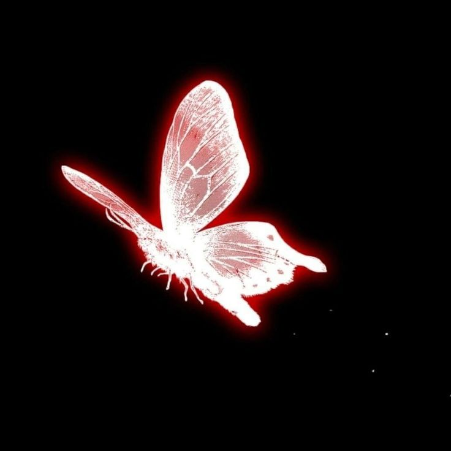

<!--- Banner -->

  

  

<!--- About me -->
### Sobre mim

Sou `Aprendiz de Service Desk` e faço graduação em `Análise e Desenvolvimento de Sistemas`. 
Apaixonada por tecnologia, design e criação de conceito! Sou formada na ETEC em **Informática para Internet**.
Estar atuando junto ao cliente como suporte me proporciona uma visão das necessidades do usuário e regras de negócio, me ajudando à criar aplicações que realmente fazem sentido!
Tenho experiência em **UX/UI** com `Figma`, conhecimentos em `HTML`, `CSS`, `JavaScript`, `PHP`, `MYSQL`, `Java` e atualmente estou aprendendo `React` e `Microsoft Intune`! 
Sou muito curiosa e estou sempre aprendendo coisas novas para evoluir cada vez mais e usar minhas habilidades para atender às necessidades dos usuários!

 

--- 

<!--- My stacks -->

### Tecnologias que uso

  

  

#### Tools
  
  
  
  

  

--- 

    
### Um pouco mais sobre mim! 
Eu gosto de criar conceitos!
Gosto de ajudar outras pessoas dentro da área de tecnologia.
Acredito que a maior forma de aprender é ensinando e trocando conhecimentos. 
Sou muito fã de BTS!

**Fale comigo:**

  
  
  

    

---

<!-- Pacman -->
<picture>
  <source media="(prefers-color-scheme: dark)" srcset="https://raw.githubusercontent.com/laracmiranda/laracmiranda/output/pacman-contribution-graph-dark.svg">
  <source media="(prefers-color-scheme: light)" srcset="https://raw.githubusercontent.com/laracmiranda/laracmiranda/output/pacman-contribution-graph.svg">
  
</picture>

---

  

<!-- Statistics -->
### Estatísticas

|  |  |  |
| :-: | :-: | :-: |

|  |  |
| :-: | :-: |

--- 

  

  

  Obrigada por visitar meu perfil! ❤️

