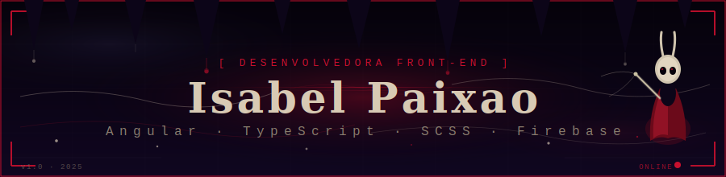

<div align="center">
  
</div>

<div align="center">

```
╔══════════════════════════════════════════════════════╗
║  Cada interface que construo é um fio com propósito  ║
╚══════════════════════════════════════════════════════╝
```

</div>

<br/>

---

<div align="center">

```
▓▓▓▓▓▓▓▓▓▓▓▓▓▓▓▓▓▓▓▓▓◈ ÁREA 01 — ORIGEM ◈▓▓▓▓▓▓▓▓▓▓▓▓▓▓▓▓▓▓▓▓▓
```

</div>

<br/>


## <span style="color:red">Sobre Mim</span>

Olá, sou **Isabel Paixão** — desenvolvedora front-end em formação, no **3° semestre de Análise e Desenvolvimento de Sistemas**.

Meu foco está em criar interfaces que vão além do funcional: interfaces que têm identidade, que se sentem vivas, que conectam quem usa ao produto de forma natural. Cada componente que escrevo, cada detalhe de layout que ajusto — é intencional.

Trabalho principalmente com **Angular 17**, TypeScript e Firebase, e tenho uma relação muito próxima com o design: costumo comparar cada implementação com a referência do Figma até estar certo.

Quando não estou codando, estou explorando metroidvanias — **Hollow Knight: Silksong** é minha maior inspiração estética, e essa identidade visual que você vê aqui é prova disso.

<br clear="right"/>

---

<div align="center">

```
▓▓▓▓▓▓▓▓▓▓▓▓▓▓▓▓▓▓▓▓▓◈ ÁREA 02 — ARSENAL ◈▓▓▓▓▓▓▓▓▓▓▓▓▓▓▓▓▓▓▓▓
```

</div>

<br/>

## <span style="color:#C8102E">Habilidades</span>

<table>
<tr>
<td width="50%" valign="top">

**Front-End**


Standalone Components · Signals · Reactive Forms
RxJS · Route Guards · Lazy Loading · Canvas 2D API

</td>
<td width="50%" valign="top">

**Back-End & Banco**


**Ferramentas**


</td>
</tr>
</table>

---

<div align="center">

```
▓▓▓▓▓▓▓▓▓▓▓▓▓▓▓▓▓▓▓▓◈ ÁREA 03 — MISSÕES ◈▓▓▓▓▓▓▓▓▓▓▓▓▓▓▓▓▓▓▓▓▓
```

</div>

<br/>

## <span style="color:#C8102E">Meu Portfolio</span>

<br/>


### Portfolio Silksong
`Angular 17 · TypeScript · SCSS · Canvas 2D`

O portfolio que você provavelmente acabou de visitar antes de chegar aqui. Desenvolvido com tema em **Hollow Knight: Silksong** — cursor customizado que deixa faíscas, 18 fios de seda no canvas atraídos pelo movimento do mouse, pixel art animada da Hornet, HUD estilo videogame e cada seção como uma área de um mapa de mundo.

Uma interface que se apresenta dentro de si mesma.

[](https://github.com/ipaixao1/portifolio-isabel)

---

<div align="center">

```
▓▓▓▓▓▓▓▓▓▓▓▓▓▓▓▓▓▓▓▓◈ ÁREA 04 — STATS ◈▓▓▓▓▓▓▓▓▓▓▓▓▓▓▓▓▓▓▓▓▓▓
```

</div>

<br/>

## <span style="color:#C8102E">GitHub Stats</span>


<div align="center">


</div>

<div align="center">

</div>

<br/>

<div align="center">

```
▓▓▓▓▓▓▓▓▓▓▓▓▓▓▓▓▓▓▓◈ ÁREA 05 — COMMIT GAME ◈▓▓▓▓▓▓▓▓▓▓▓▓▓▓▓▓▓▓
```

</div>

<br/>

<div align="center">


</div>

---

<div align="center">

```
▓▓▓▓▓▓▓▓▓▓▓▓▓▓▓▓▓▓▓▓▓◈ ÁREA 06 — NEXO ◈▓▓▓▓▓▓▓▓▓▓▓▓▓▓▓▓▓▓▓▓▓▓
```

</div>

<br/>

## <span style="color:#C8102E">Contato</span>

<div align="center">

[](https://www.linkedin.com/in/isabel-paix%C3%A3o%F0%9F%A6%8B-2abb45231/)
[](mailto:sisabelvirginia@gmail.com)
[](https://wa.me/557398158341)
[](https://github.com/ipaixao1/portifolio-isabel)

<br/>


<br/>

```
╔═══════════════════════════════════════════════════════════╗
║                                                           ║
║   "Não crio apenas páginas —                              ║
║    teço sistemas onde cada fio tem propósito."            ║
║                                                           ║
╚═══════════════════════════════════════════════════════════╝
```


</div>
